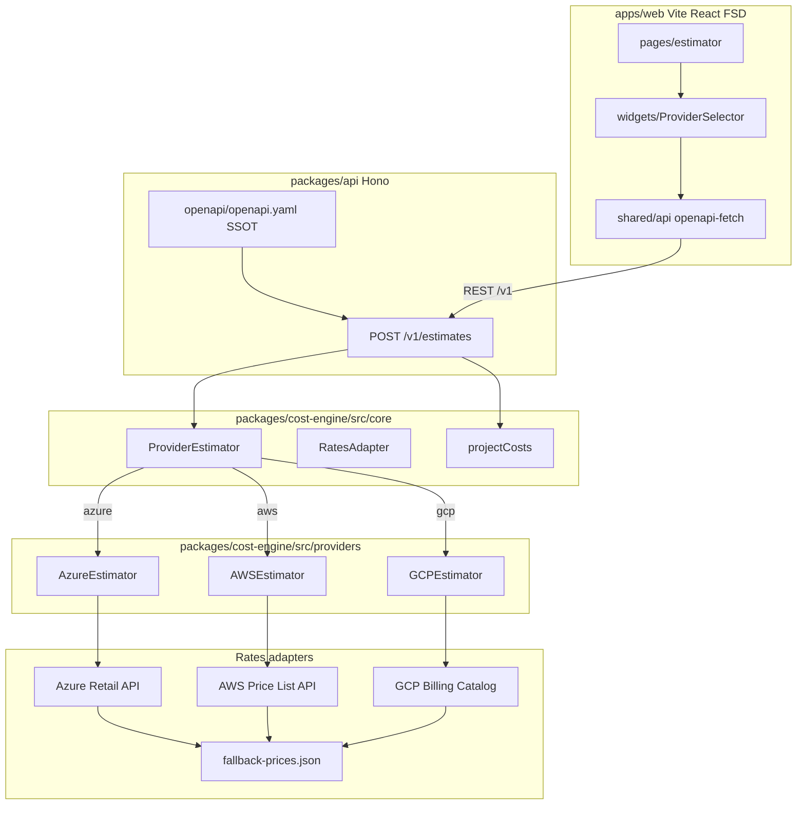
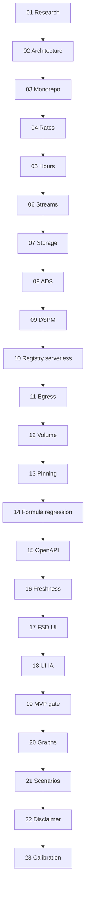

# Cloud Connector Cost Estimator (Multi-Cloud Core + Azure/AWS/GCP)

## Decisions locked

- **Repo root:** `[cloud-connector](.)` — one app for **Azure, AWS, and GCP**.
- **Bill scope:** customer cloud infrastructure only (no Cortex SaaS license line).
- **Layout:** generics in `packages/cost-engine/src/core`; provider specifics in `packages/cost-engine/src/providers/{azure,aws,gcp}`; REST in `packages/api`; UI in `apps/web`; OpenAPI SSOT in `openapi/openapi.yaml`.
- **Ports:** `ProviderEstimator`, `RatesAdapter`, `MeterMap` — every provider implements the same interfaces.
- **MVP gate:** packages **01–19** = shippable multi-cloud estimator (Azure + AWS + GCP formulas + rates + UI). **Post-MVP delivered:** **20** graphs/projections, **21** scenarios/share, **22** disclaimer/tags, **23** calibration CSV.
- **Stack:** pnpm, TypeScript strict, Hono (Node 22+), Vite + React 19 FSD, OpenAPI 3.1 + openapi-typescript/openapi-fetch, Zod validation, lightweight charts.
- **Execution discipline:** todos top→bottom `[01/23]`…`[23/23]`; each package **REQ → AC → TEST → EDGE** before the next. Plan status: **all-complete**.
- **Plan-execute:** default auto-continue stops after MVP (`mvpStop=19`); post-MVP requires explicit `bash scripts/plan-execute-enable.sh --through-all`.
- **Accuracy honesty:** audit streams High confidence; ADS Med; DSPM/registry/serverless Low — never present Low bands as precise quotes.
- **Existing Azure TF:** `[azure/data](azure/data)` remains SSOT for Azure onboarding inventory; do not mutate TF for the estimator.

## Architectural breakdown (`cloud-connector`)

### Folder structure

```text
cloud-connector/
├── azure/data/                      # existing Cortex Azure TF (unchanged)
├── aws/                             # stub README — future AWS connector IaC
├── gcp/                             # stub README — future GCP connector IaC
├── docs/
│   ├── ARCHITECTURE.md
│   ├── CLOUD_COST_MODEL.md
│   ├── COST_MODEL_CHANGELOG.md
│   ├── DEFINITION_OF_DONE.md        # MVP 01–19 + post-MVP 20–23 checklist
│   └── TAGGING.md                   # cost-allocation tag/label guidance (pkg 22)
├── openapi/
│   └── openapi.yaml                 # SSOT REST Contract (OAS 3.1)
├── packages/
│   ├── cost-engine/                 # Pure TypeScript (zero React/HTTP)
│   │   ├── src/
│   │   │   ├── core/                # GENERIC CORE
│   │   │   │   ├── ports/
│   │   │   │   │   ├── provider-estimator.interface.ts
│   │   │   │   │   └── rates-adapter.interface.ts
│   │   │   │   ├── models/
│   │   │   │   │   ├── estimate.types.ts
│   │   │   │   │   ├── rate-card.types.ts
│   │   │   │   │   └── volume-signals.types.ts
│   │   │   │   ├── hours.ts
│   │   │   │   ├── project-costs.ts
│   │   │   │   └── rate-pinning.ts
│   │   │   ├── providers/
│   │   │   │   ├── azure/
│   │   │   │   │   ├── azure-estimator.ts
│   │   │   │   │   ├── azure-rates-adapter.ts
│   │   │   │   │   ├── capability-meter-map.ts
│   │   │   │   │   └── fallback-prices.json
│   │   │   │   ├── aws/
│   │   │   │   │   ├── aws-estimator.ts
│   │   │   │   │   ├── aws-rates-adapter.ts
│   │   │   │   │   ├── capability-meter-map.ts
│   │   │   │   │   └── fallback-prices.json
│   │   │   │   └── gcp/
│   │   │   │       ├── gcp-estimator.ts
│   │   │   │       ├── gcp-rates-adapter.ts
│   │   │   │       ├── capability-meter-map.ts
│   │   │   │       └── fallback-prices.json
│   │   │   └── index.ts
│   │   └── package.json
│   └── api/                         # Hono API Server
│       ├── src/
│       │   ├── adapters/
│       │   ├── handlers/
│       │   └── index.ts
│       └── package.json
├── apps/
│   └── web/                         # Vite + React 19 (FSD)
│       ├── src/
│       │   ├── app/
│       │   ├── pages/
│       │   ├── widgets/
│       │   ├── features/
│       │   ├── entities/
│       │   └── shared/              # openapi-fetch + generated types
│       └── package.json
├── sources/
│   └── OFFICIAL_FORMULA_CHECKS.md
├── scripts/
│   └── refresh-fallback-prices.mjs
└── pnpm-workspace.yaml
```

### Multi-cloud component interaction




### Division of responsibilities


| Zone             | Location                        | Responsibilities                                                                                                                                   |
| ---------------- | ------------------------------- | -------------------------------------------------------------------------------------------------------------------------------------------------- |
| **Generic core** | `packages/cost-engine/src/core` | `ProviderEstimator`, `RatesAdapter`, hours/proration, `projectCosts`, rate pinning/`modelVersion`, shared DTOs/confidence bands                    |
| **Azure module** | `providers/azure`               | Event Hubs TU math (1 MB/s or 1000 eps, 84 GB/TU), Blob LRS, Managed Disk snapshots, Retail Prices adapter, map from `azure/data` TF               |
| **AWS module**   | `providers/aws`                 | Kinesis shard-hours + SQS, S3 Standard, EBS snapshots + Outpost EC2, Price List adapter, CloudTrail/GuardDuty→meter map                            |
| **GCP module**   | `providers/gcp`                 | Pub/Sub volume + storage, GCS Standard + Class A/B ops, Persistent Disk snapshots + GCE scanner, Billing Catalog adapter, Audit Logs/SCC→meter map |
| **REST**         | `packages/api`                  | OpenAPI Zod validation, ProblemDetails, CORS-safe price proxies, `/v1/`* routes                                                                    |
| **UI**           | `apps/web`                      | Provider selector, FSD layers, charts/export — **no formula logic**                                                                                |


### Multi-provider capability and billing map


| Capability  | Azure                                       | AWS                                   | GCP                               | Confidence |
| ----------- | ------------------------------------------- | ------------------------------------- | --------------------------------- | ---------- |
| Discovery   | $0 (`cortex-reader`)                        | $0 (IAM ReadOnly)                     | $0 (IAM Viewer)                   | High       |
| Audit logs  | EH Standard TU + ingress + overage >84GB/TU | Kinesis shard-hours + ingress GB + S3 | Pub/Sub GB + storage overage      | High       |
| ADS Cloud   | Snapshot GB-mo × (lifetimeHours/730)        | EBS snapshot same proration           | PD snapshot same proration        | Medium     |
| ADS Outpost | Snapshots + scanner VM                      | Snapshots + EC2                       | Snapshots + GCE                   | Medium–Low |
| DSPM        | Blob reads + ephemeral RG compute           | S3 GET/LIST + ephemeral EC2           | GCS Class B + ephemeral compute   | Low        |
| Registry    | ACR pull/transfer                           | ECR pull/transfer                     | Artifact Registry pull/transfer   | Medium–Low |
| Serverless  | Functions package copy/ops                  | Lambda/S3 package reads               | Cloud Functions/Run artifact copy | Low        |


### REST surface (`/v1`)


| operationId        | Method path                     | Description                              |
| ------------------ | ------------------------------- | ---------------------------------------- |
| `getHealth`        | GET /v1/health                  | Liveness                                 |
| `getCapabilities`  | GET /v1/capabilities?provider=  | Capability/meter maps                    |
| `getRates`         | GET /v1/rates?provider=&region= | RateCard + freshness                     |
| `refreshRates`     | POST /v1/rates/refresh          | Live pull from provider price APIs       |
| `createEstimate`   | POST /v1/estimates              | Monthly line items + totals + confidence |
| `createProjection` | POST /v1/projections            | 1–36 month series + period table         |


Request bodies include `provider: azure | aws | gcp`. Errors: RFC 7807 `ProblemDetails`. `additionalProperties: false` on estimate bodies.

## Execution order (mandatory)

**Rule:** Implement todos **strictly top-to-bottom**. Each package **REQ → AC → TEST → EDGE**. Do not start N+1 until N EDGE is complete.




| Phase             | Packages | Goal                                                                                      | Status        |
| ----------------- | -------- | ----------------------------------------------------------------------------------------- | ------------- |
| **P0 Foundation** | 01–03    | Multi-cloud research + architecture + monorepo                                            | **complete**  |
| **P1 Engine**     | 04–14    | Rates (3 providers), hours, all capability formulas, volume, pinning, official regression | **complete**  |
| **P2 API**        | 15–16    | OpenAPI + `projectCosts` + freshness                                                      | **complete**  |
| **P3 UI MVP**     | 17–19    | FSD + IA + multi-cloud acceptance — **MVP exit**                                          | **complete**  |
| **P4 Insights**   | 20–21    | Graphs + provider/scenario compare                                                        | **complete**  |
| **P5 Trust**      | 22–23    | Disclaimer polish + calibration                                                           | **complete**  |


**Hard dependencies**

- 04 Rates before 06–11 meter math.
- 05 Hours before stream/ADS proration.
- **15 must implement `projectCosts` in core before `createProjection` AC.**
- 15 before 16–17 (typed client + RateCard freshness).
- 17 = structure; 18 = IA; 19 = E2E MVP — no formulas in any.
- MVP stop line after **19**; continue 20–23 only with through-all opt-in (or explicit user request) — **20–23 now complete**.

## Definition of done (full plan = packages 01–23)

SSOT checklist also lives in [`docs/DEFINITION_OF_DONE.md`](../../docs/DEFINITION_OF_DONE.md).

### MVP (01–19)

- [x] Packages 01–19 EDGE green; `pnpm test` + spectral + boundary lint pass
- [x] Provider switcher Azure/AWS/GCP; each produces real estimate line items (not stubs)
- [x] Demo presets audit-only + comprehensive per provider
- [x] Export JSON includes `provider`, `modelVersion`, `ratesAsOf`, `disclaimer`
- [x] `docs/ARCHITECTURE.md` + `CLOUD_COST_MODEL.md` + `OFFICIAL_FORMULA_CHECKS.md` with `checkedAt`
- [x] No Cortex SaaS line; no silent stale-price export; no cross-provider rate mix

### Post-MVP (20–23)

- [x] **20** Graphs & projections — 1–36 month series, cumulative/volume views, stale banner
- [x] **21** Scenarios & share — provider or tier compare, `?s=` URL restore, localStorage last share
- [x] **22** Disclaimer & tags — session-only collapse, `docs/TAGGING.md` cites
- [x] **23** Calibration CSV — Azure/AWS/GCP local import, volume factor apply (no upload)

## MVP and execution principles

1. **Top-to-bottom:** 01→19 for MVP; 20–23 post-MVP — **all packages complete**.
2. **Provider readiness:** Azure is baseline from `azure/data` TF; AWS and GCP get **full** schemas, rates adapters, and formula implementations in Phase 1 (same packages 04–14) — not deferred stubs for MVP. IaC stubs remain under `aws/` and `gcp/` README only.
3. **No UI calculation logic:** formulas only in `packages/cost-engine`.
4. **Reproducibility first:** every estimate includes `modelVersion`, `ratesAsOf`, `provider`, and input hash.

## Out of scope (v1)

- Cortex Cloud SaaS / license pricing
- Mutating `azure/data` Terraform
- Cloud hosting / auth (local `pnpm dev` + optional Docker)
- OAuth into customer Cost Management / Cost Explorer / Cloud Billing APIs (CSV calibration only)
- Multi-currency FX (USD list/Retail only; fail closed otherwise)
- Server-side persistence of customer estimates

