# Deps latest + EDGE tests (01–23) + run the app

**SSOT plan file:** [`.cursor/plans/edge_tests_and_run_app_cda0b11e.plan.md`](.cursor/plans/edge_tests_and_run_app_cda0b11e.plan.md)

## Scope interpretation

- **Dependencies:** bump **all direct** dependencies and devDependencies across the pnpm workspace to **latest** published versions, then regenerate the lockfile.
- **“Every todo”** (EDGE work) = every plan **EDGE** item (`edge-*`, packages **01–23**), not all 92 REQ/AC/TEST/EDGE rows.
- Deliverable order: **deps → EDGE+ tests → `pnpm test` → run the app**.
- Do **not** reopen formulas in the UI; keep fail-closed / no silent `$0` / no silent fallbacks.

## Workspace packages in scope

| Manifest                                                                 | Role                                                 |
| ------------------------------------------------------------------------ | ---------------------------------------------------- |
| [`package.json`](package.json)                                           | Root: `packageManager`, spectral, openapi-typescript |
| [`apps/web/package.json`](apps/web/package.json)                         | Vite, React, Playwright, vitest, openapi-fetch       |
| [`packages/api/package.json`](packages/api/package.json)                 | Hono, Zod, Node server                               |
| [`packages/cost-engine/package.json`](packages/cost-engine/package.json) | Engine + vitest                                      |

Also update [`pnpm-lock.yaml`](pnpm-lock.yaml). Keep `engines.node: ">=22"`. Prefer latest **pnpm** via `packageManager` field if a newer major/minor is current.

## Package 24 — dependency upgrade (before EDGE+)

### Method (fail closed)

1. From repo root: `pnpm update -r --latest` (or `pnpm up -r -L` for all workspace packages).
2. If majors break build/types, **fix call sites** (preferred) or document a temporary pin with reason — never hide with `--force` / ignored peer failures.
3. Re-run `pnpm install`, `pnpm build`, `pnpm test`.
4. Verify with `pnpm outdated -r` (direct deps clean).

### EDGE for deps

- Install/peer errors → non-zero exit; do not skip optional packages to fake green.
- OpenAPI / Spectral / Playwright / React 19 peer mismatches must be resolved explicitly.
- Commit lockfile with the code changes (when user asks to commit).

## Package 25 — EDGE hardening

### Current EDGE gaps (implement first)

- **15** OpenAPI: version-bump / deprecated-param policy
- **16** Freshness: partial live meter merge fail-closed; proxy-only client
- **18** UI IA: section skeleton testids
- **19** MVP: mobile viewport / e2e critical-stale export ack
- **20** Projections: hatched low-confidence envelope UI
- **21** Share: localStorage quota + malformed-share toast UI
- **22** Disclaimer: session-collapse RTL (not permanent hide)

Then add EDGE+ deepeners for **01–14, 17, 23**.

### Where new tests go

| Packages | Home                                                                                                                                                                                                                                                                           | New EDGE+ focus                                  |
| -------- | ------------------------------------------------------------------------------------------------------------------------------------------------------------------------------------------------------------------------------------------------------------------------------ | ------------------------------------------------ |
| 01–03    | [`capability-meter-map.test.ts`](packages/cost-engine/src/providers/__tests__/capability-meter-map.test.ts), [`architecture.test.ts`](packages/cost-engine/src/core/__tests__/architecture.test.ts), [`monorepo.test.ts`](packages/cost-engine/src/__tests__/monorepo.test.ts) | Extra fail-closed / anti-leak / layout assertion |
| 04–14    | Existing provider/core `__tests__`                                                                                                                                                                                                                                             | One **new** case each — no duplicate titles      |
| 15       | [`openapi-rest.test.ts`](packages/api/src/__tests__/openapi-rest.test.ts)                                                                                                                                                                                                      | Version / deprecated policy                      |
| 16       | [`price-freshness.test.ts`](packages/cost-engine/src/providers/rates/__tests__/price-freshness.test.ts) + thin web/api                                                                                                                                                         | Partial live fail-closed; no retail host imports |
| 17–19    | web vitest + [`mvp-happy-path.spec.ts`](apps/web/e2e/mvp-happy-path.spec.ts)                                                                                                                                                                                                   | Skeleton; mobile; stale export ack               |
| 20–22    | projections / share-compare / disclaimer tests                                                                                                                                                                                                                                 | Envelope; quota+toast; session collapse          |
| 23       | calibration suite                                                                                                                                                                                                                                                              | Extra currency/size variant if unique            |

### Meta-gate

Scan for `package NN — EDGE+` markers for **NN=01..23**; missing → fail closed.

## Append to azure plan

Append packages **24** and **25** to [`.cursor/plans/azure_cortex_cost_estimator_4075e709.plan.md`](.cursor/plans/azure_cortex_cost_estimator_4075e709.plan.md) via handoff gaps (`[24/25]` / `[25/25]` tags + `--check` green).

```mermaid
flowchart LR
  deps[Pkg24 bump deps to latest] --> lock[Regenerate lockfile]
  lock --> buildTest[pnpm build and test]
  buildTest --> inventory[Inventory EDGE ids 01-23]
  inventory --> gaps[Fill gap packages 15-16 18-22]
  gaps --> deepen[EDGE+ deepeners 01-14 17 23]
  deepen --> meta[Meta-test EDGE+ per NN]
  meta --> pnpmTest[pnpm test]
  pnpmTest --> runApp[dev:api 8787 + dev:web 5173]
  runApp --> smoke[Smoke estimator UI]
```



## Run the app (after tests green)

```bash
pnpm --filter @cloud-connector/api start   # :8787
pnpm --filter @cloud-connector/web dev     # :5173 proxies /v1
```

Smoke: open estimator, switch Azure→AWS, run estimate, confirm breakdown + disclaimer.

## Execution order

1. Append packages **24** (deps) and **25** (EDGE+) to the azure plan from this SSOT.
2. Bump all workspace deps to latest; fix breakages; lockfile + `pnpm build` + `pnpm test`.
3. Implement EDGE gap packages **15,16,18–22**.
4. Add EDGE+ deepeners for **01–14,17,23** + meta-test.
5. `pnpm test` green → start `dev:api` + `dev:web` → smoke → plan-execute handoff.
