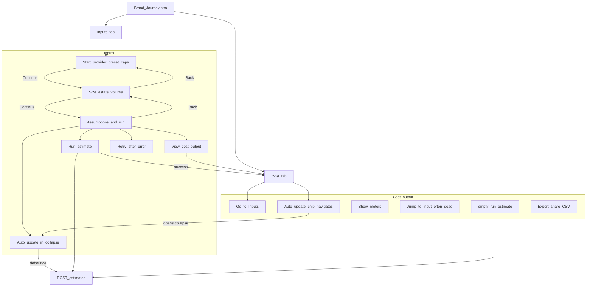
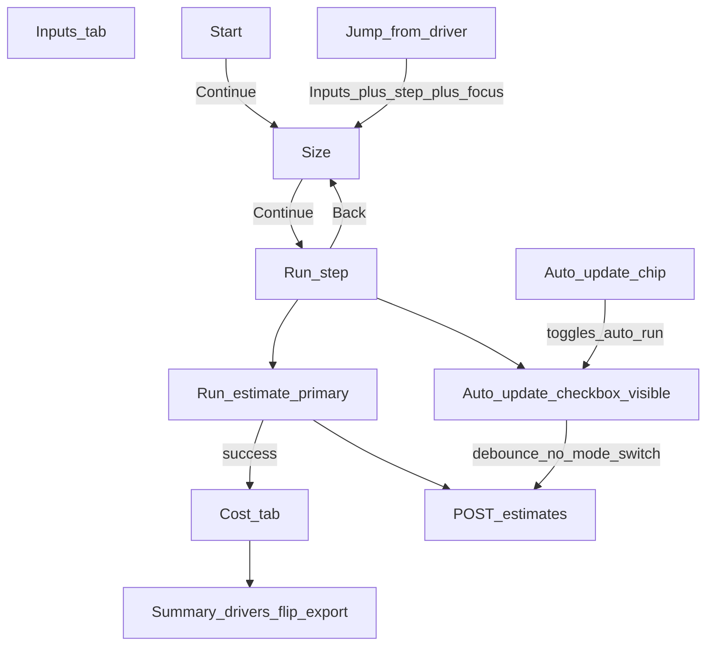

# Estimator button flow — concept then straighten

## 1. Current flowgraph (as-built)

### Pain (why straighten)

| Problem | User effect |
|---------|-------------|
| **Run + View cost + Cost tab** | Three ways to “see cost”; View does not refresh |
| **Continue disabled on last step** | Looks broken; users expect Continue → results |
| **Auto-update buried + chip navigates** | Chip looks like a toggle; it teleports to Inputs |
| **Retry ≈ Run** | Duplicate primary |
| **Jump-to-input from Cost** | Often no visible effect (hidden Inputs panel) |
| **empty-run-estimate vs Run** | Second Run entry |

---

## 2. Concept — how the UI should work

**Jobs**

1. **Enter** (Inputs) — set what feeds the estimate  
2. **Compute** (Run) — one deliberate action when ready (or leave Auto-update on while editing)  
3. **Read** (Cost output) — understand $, drivers, then details / export  

**Happy path (minimal presses)**

1. Inputs · Start — pick **Azure · audit-only** (or set provider + caps)  
2. **Continue** → Size (tweak only if needed) → **Continue** → Run  
3. Press **Run estimate** once → land on Cost with monthly $ + drivers  
4. Optional: flip meters, Projections, Compare, Export  

**While refining**

- Leave **Auto-update** on (visible next to Run). Editing Size refreshes the estimate **without** leaving Inputs.  
- Open **Cost** tab anytime to read; if nothing computed yet → **Go to Inputs**.  
- From a driver, **Jump to input** must switch to the right Inputs step and focus the field.

**Advanced (not in the happy path)**

- Assumptions knobs, offline, freeze rates, billing calibration, inputs CSV import — stay behind Advanced / Export.

**Primary vs secondary rule**

- **One primary CTA per screen**: Continue (steps 1–2) or Run estimate (step 3) or results-tab content actions.  
- Mode tabs = navigation, not “do work.”  
- Never two adjacent buttons that both claim to show cost.

---

## 3. Target flowgraph (after cleanup)

### Concrete control changes

| Control | Action |
|---------|--------|
| `view-cost-output` | **Remove** |
| `retry-estimate` | **Remove**; `run-estimate` label becomes “Retry estimate” when `error` |
| `journey-step-continue` on last step | **Hide** (not disabled primary) — only Back + Run |
| `auto-update-toggle` | **Surface** beside Run (still also in Advanced for offline/freeze) |
| `auto-update-status-chip` | **Toggle** `autoRunEnabled` in place; stay on Cost |
| `jump-*` | **Fix** → `goToInputsStep` + focus (Size for volume, Start for caps) |
| `empty-run-estimate` | **Remove** if Cost empty already has Go to Inputs; else same as Run with `switchToCost` |
| `freeze-rates` / offline / calibration | **Keep** Advanced only |
| sr-only `demo-preset-*` | **Keep** (e2e; not user-visible) |

### Copy (Run step)

- Hint under Run: “Auto-update refreshes the estimate as you edit. Run switches you to Cost output when ready.”  
- Do not invent prices; no change to cost-engine.

---

## 4. Implementation (small blast radius)

Touch primarily:

- [`InputsJourneySteps.tsx`](apps/web/src/widgets/InputsJourneySteps/InputsJourneySteps.tsx) — hide Continue on last step  
- [`EstimatorPage.tsx`](apps/web/src/pages/estimator/EstimatorPage.tsx) — remove View cost / Retry; surface auto-run; Run label  
- [`ResultsSummary.tsx`](apps/web/src/widgets/ResultsSummary/ResultsSummary.tsx) — chip toggles auto-run (`onAutoUpdateToggle`)  
- [`CostDrivers.tsx`](apps/web/src/widgets/CostDrivers/CostDrivers.tsx) — jump callback + remove/repurpose empty-run  
- New short [`docs/ESTIMATOR_UI_FLOW.md`](docs/ESTIMATOR_UI_FLOW.md) — concept + inventory SSOT  
- Tests: [`estimator-journey.test.tsx`](apps/web/src/__tests__/estimator-journey.test.tsx), [`ui-ia.test.tsx`](apps/web/src/__tests__/ui-ia.test.tsx), e2e [`mvp-happy-path.spec.ts`](apps/web/e2e/mvp-happy-path.spec.ts)

---

## 5. Quadruple rollup

| Kind | Criteria |
|------|----------|
| **REQ** | Concept doc + CTA straighten (one Run primary; no View cost; chip toggles; jumps work) |
| **AC** | Happy path Continue×2 → Run → $; no duplicate cost nav button; chip stays on Cost |
| **TEST** | Journey/unit + e2e without view-cost; chip toggle; jump opens Size |
| **EDGE** | Error→Retry label; empty Cost CTA; debounce no mode yank; Advanced intact |

Out of scope: cost-engine, new capabilities, sticky layout, redesign of export formats.
