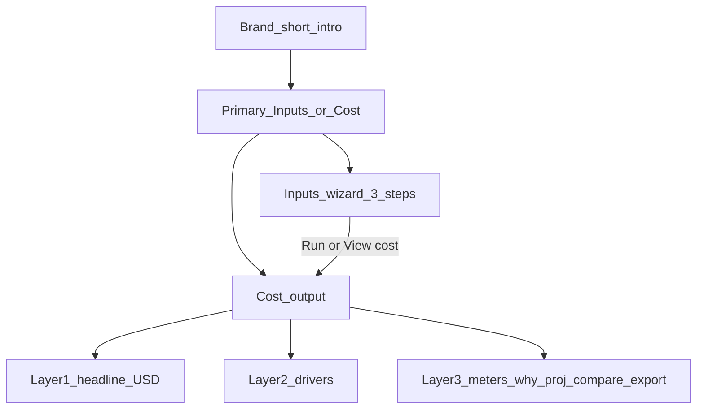

# Estimator UX cleanup — journey, cost layers, progressive disclosure

Supersedes the thinner [journey tabs sketch](file:///Users/sstraube/.cursor/plans/estimator_journey_tabs_4f2a1c08.plan.md) with research-backed IA and a clear **first cost vs details** model.

## Research principles applied

Sources: [NN/G wizards](https://www.nngroup.com/articles/wizards/), [NN/G tabs](https://www.nngroup.com/articles/tabs-used-right/), multi-step form / pricing-calculator guidance (chunk 3–5 steps, progress, progressive disclosure), progressive-disclosure patterns (basic vs advanced).

| Principle                                      | Application here                                                                                                            |
| ---------------------------------------------- | --------------------------------------------------------------------------------------------------------------------------- |
| **Wizard for sequential setup**                | Inputs use a stepper (Start → Size → Run), not peer tabs for required fields                                                |
| **Tabs for parallel views of the same result** | Cost output uses tabs (Cost, Projections, Compare)—same estimate, different lenses                                          |
| **Progressive disclosure**                     | First paint = essential inputs + headline $ + drivers; meters, assumptions, calibration, export, “Why” behind named reveals |
| **Don’t bury price/errors**                    | Monthly expected, freshness, estimate errors stay visible in Cost mode / Run step—not inside collapsed chrome               |
| **One primary job per mode**                   | Inputs = enter; Cost = understand / export                                                                                  |
| **No focus yank**                              | Auto-update refreshes numbers; mode switch only on explicit Run / View cost                                                 |
| **No sticky dual-column**                      | Keep full-page single column from prior IA                                                                                  |

## Problem (as-built)

After full-page IA, [`EstimatorPage`](apps/web/src/pages/estimator/EstimatorPage.tsx) is still **one long enter+read scroll**: how-to → ~6 config cards → run → read → export. Cost already has sub-tabs, but users cannot tell “what must I enter?” from “what is my cost / how do I drill in?”

Clutter hotspots: duplicate how-to copy, volume section stacking stream + capability volumes + calibration, dense `ResultsSummary`, CostDrivers “Why” + sensitivity + share table all on first Cost paint, flip-inside-tab as a third orientation layer.

## Target mental model

### What data feeds the first cost (must enter)

| Need                             | UI home                                  |
| -------------------------------- | ---------------------------------------- |
| Provider + region                | Inputs · Start                           |
| Capabilities (or preset)         | Inputs · Start                           |
| Estate / volume for enabled caps | Inputs · Size (preset fills audit peaks) |
| Run (or auto-update already on)  | Inputs · Assumptions & run               |

**Preset path:** Azure · audit-only → Start filled → Size mostly filled → Run → Cost. That is the happy path.

### What is detail-only (after first $)

- Model knobs, stream lock, calibration CSV, offline/freeze
- Meter line items (flip / “Show meters”)
- Driver “Why”, sensitivity nudges, numeric share table
- Grounding / assumptions snapshot
- Projections, Compare
- Export / share / inputs CSV
- Long BillingHelp (keep fail-closed API warnings visible)

---

## Structure to build

### 1. Primary modes (tabs — parallel jobs)

`EstimatorJourneyShell`: **Inputs** | **Cost output**  
`data-testid`: `journey-tab-inputs`, `journey-tab-cost`  
URL `?view=inputs|cost` — invalid → `inputs`.

Short intro above tabs (replace long [`HowToUseEstimator`](apps/web/src/widgets/HowToUseEstimator/HowToUseEstimator.tsx) scroll):

- **Inputs** — enter cloud, capabilities, size
- **Cost output** — monthly spend, what drives it, then details
- One TF honesty line

### 2. Inputs = wizard (sequential)

[`InputsJourneySteps`](apps/web/src/widgets/InputsJourneySteps/InputsJourneySteps.tsx): **Start → Size → Assumptions & run**  
Progress: “Step _n_ of 3”. Continue / Back. Panels **keep mounted, hide inactive** (state + auto-run live).

| Step              | Visible by default                                                             | Behind “Advanced”                                 |
| ----------------- | ------------------------------------------------------------------------------ | ------------------------------------------------- |
| Start             | Provider, region, presets, capability toggles                                  | BillingHelp (closed details)                      |
| Size              | Estate + stream volume for audit; capability volumes only for **enabled** caps | Calibration                                       |
| Assumptions & run | Run / Retry, live status, freshness/error                                      | Assumptions knobs, offline/freeze/auto disclosure |

Checklist under stepper: missing required fields for enabled caps (e.g. DSPM estate GB)—fail-closed copy, no invented numbers.

Footer last step: **Run estimate** + **View cost output**. Explicit Run success → switch to Cost once. Debounced auto-update does **not** switch mode.

### 3. Cost output = layered reading

| Layer           | Always / on demand | Content                                                                                                                |
| --------------- | ------------------ | ---------------------------------------------------------------------------------------------------------------------- |
| **L1 Headline** | Always             | Slim `ResultsSummary`: monthly $, freshness, auto-chip. Bands/confidence/provenance → grounding `
` by default |
| **L2 Drivers**  | Default Cost tab   | Capability driver bars only (primary “why is it this much?”)                                                           |
| **L3 Details**  | Named controls     | “Show meters” (existing flip), “Why this driver” expand, Projections tab, Compare tab, Export & notes                  |

**Cost output sub-tabs** (parallel lenses — NN/G tabs OK here):

1. **Cost** (default) — L2 drivers; meters via one control (prefer flip label “Show meter line items”)
2. **Projections**
3. **Compare**

Export moves into Cost mode (answer affinity). Inputs CSV labeled clearly as input edit, not results $.

Empty Cost (no estimate): CTA **Go to Inputs** + one sentence. No fake $0 invent.

### 4. Cross-mode jumps

Affects chips / driver focus / auto-chip: switch to Inputs + correct step, then focus control (not `scrollIntoView` on a `hidden` panel alone).

### 5. CSS / chrome

Journey + stepper styles in [`styles.css`](apps/web/src/app/styles.css). **No** `position: sticky`. Densify summary; collapse numeric share table or keep behind “Share by capability” details.

---

## Files

- New: `EstimatorJourneyShell.tsx`, `InputsJourneySteps.tsx`, `JourneyIntro.tsx`, `CostOutputEmpty.tsx`, `shared/lib/journey-view.ts`
- Edit: [`EstimatorPage.tsx`](apps/web/src/pages/estimator/EstimatorPage.tsx), [`HowToUseEstimator`](apps/web/src/widgets/HowToUseEstimator/HowToUseEstimator.tsx) (slim or replace), [`ResultsSummary`](apps/web/src/widgets/ResultsSummary/ResultsSummary.tsx), [`CostDrivers`](apps/web/src/widgets/CostDrivers/CostDrivers.tsx), [`ResultFlipCard`](apps/web/src/widgets/ResultFlipCard/ResultFlipCard.tsx), [`styles.css`](apps/web/src/app/styles.css)
- Tests: [`ui-ia.test.tsx`](apps/web/src/__tests__/ui-ia.test.tsx), new `estimator-journey.test.tsx`, e2e [`mvp-happy-path.spec.ts`](apps/web/e2e/mvp-happy-path.spec.ts)

No cost-engine / OpenAPI / honesty string / sticky restoration.

---

## Quadruple (rollup)

| Kind     | Criteria                                                                                                                                                                                             |
| -------- | ---------------------------------------------------------------------------------------------------------------------------------------------------------------------------------------------------- |
| **REQ**  | User enters only what feeds first cost via a 3-step Inputs wizard, then reads Cost output in layers (headline → drivers → optional details)                                                          |
| **AC**   | Primary Inputs\|Cost tabs; Start/Size/Run steps; Cost shows $ + drivers by default; meters/projections/compare/export reachable; checklist for missing cap fields; sticky absent; one ResultsSummary |
| **TEST** | Mode/step navigation; Run→Cost switch; debounce does not switch; empty Cost CTA; jump opens Inputs step; ui-ia + e2e azure-audit meters allowlist                                                    |
| **EDGE** | Invalid `?view=`; DSPM zero estate fail-closed on Size/Run; hidden Input steps keep state; dual tablist a11y (`aria-selected`); keyboard Continue                                                    |

## Detailed task list (SSOT = frontmatter todos)

### [REQ] Build (12)

| ID                        | Task                                                                                                         |
| ------------------------- | ------------------------------------------------------------------------------------------------------------ |
| `req-01-journey-shell`    | Create `EstimatorJourneyShell` — Inputs\|Cost tablist, `aria-selected`, controlled `journeyMode`             |
| `req-02-inputs-steps`     | Create `InputsJourneySteps` — start\|size\|run, Step n of 3, Continue/Back, keep-mounted hide inactive       |
| `req-03-journey-intro`    | Create `JourneyIntro` / slim HowToUse — 2-bullet intro + honesty; remove long how-to + `results-how-to-read` |
| `req-04-cost-empty`       | Create `CostOutputEmpty` — `cost-empty-go-inputs` when no estimate                                           |
| `req-05-journey-view-url` | Add `shared/lib/journey-view.ts` — `?view=inputs\|cost`; invalid → inputs                                    |
| `req-06-page-start-step`  | Page Inputs·Start — provider, region, presets, caps; BillingHelp closed                                      |
| `req-07-page-size-step`   | Page Inputs·Size — estate + stream; enabled-cap volumes; Calibration Advanced                                |
| `req-08-page-run-step`    | Page Inputs·Run — banners + Run visible; Advanced knobs; `view-cost-output`                                  |
| `req-09-page-cost-mode`   | Page Cost mode — summary → grounding → honesty → canvas → Export                                             |
| `req-10-run-mode-switch`  | Explicit Run success → Cost once; not on debounce                                                            |
| `req-11-cross-mode-jumps` | Chips / drivers / auto-chip → Inputs + step + focus                                                          |
| `req-12-journey-css`      | Journey/stepper CSS; no sticky                                                                               |

### [AC] Progressive disclosure (7)

| ID                           | Task                                                             |
| ---------------------------- | ---------------------------------------------------------------- |
| `ac-01-checklist`            | `journey-checklist` missing fields per enabled cap; never invent |
| `ac-02-slim-summary`         | Slim ResultsSummary; bands/confidence in `results-grounding`     |
| `ac-03-defer-drivers-detail` | CostDrivers bars first; Why/share behind details                 |
| `ac-04-flip-labels`          | Flip labels: Show meter line items / Show drivers                |
| `ac-05-one-summary`          | One `results-summary` only in Cost mode                          |
| `ac-06-no-sticky`            | Confirm no sticky layout                                         |
| `ac-07-walkthrough`          | Manual Azure audit → Cost layers path                            |

### [TEST] Automated (5)

| ID                        | Task                                             |
| ------------------------- | ------------------------------------------------ |
| `test-01-journey-unit`    | `estimator-journey.test.tsx` mode + steps + aria |
| `test-02-run-to-cost`     | Run→Cost; debounce keeps Inputs                  |
| `test-03-empty-and-jumps` | Empty CTA; jump/auto-chip focus                  |
| `test-04-ui-ia`           | Update `ui-ia.test.tsx` for journey              |
| `test-05-e2e`             | Update `mvp-happy-path.spec.ts` journey path     |

### [EDGE] Fail-closed (6)

| ID                           | Task                                                |
| ---------------------------- | --------------------------------------------------- |
| `edge-01-url-view`           | Invalid/empty view; cost-without-estimate empty CTA |
| `edge-02-dspm-estate`        | DSPM estate=0 checklist + fail-closed Run           |
| `edge-03-keep-mounted`       | State preserved across mode switches                |
| `edge-04-keyboard`           | Tablist + Continue/Back by keyboard                 |
| `edge-05-dual-tablists`      | Distinct `aria-label`s Journey vs Results views     |
| `edge-06-honesty-regression` | No sticky; honesty banner on comprehensive Cost     |

**Order:** REQ 01–12 → AC 01–07 → TEST 01–05 → EDGE 01–06 → `pnpm --filter @cloud-connector/web test`.

## Out of scope

- New pricing formulas or TF meters
- Sticky mini-summary bar
- Separate SPA routes beyond `?view=`
- Analytics funnel instrumentation (nice-to-have later)
