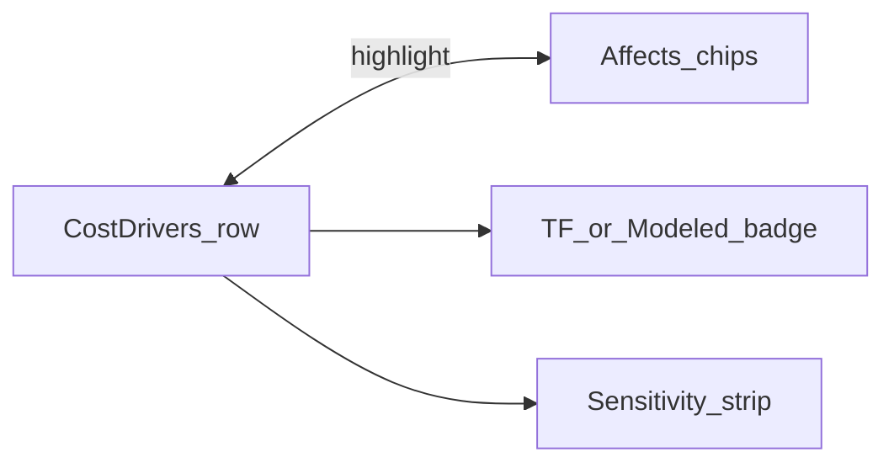

# Cost literacy UX polish (drivers ↔ chips ↔ honesty)

## Goal

Make **number → meter → $** impossible to miss: sync drivers with Affects chips, badge TF vs modeled, teach sizing with what-if on the top driver, bootstrap first paint with Azure audit-only, and reduce chrome noise.

## Default scope

Ship all eight improvements as ordered packages **01/07–07/07**. Skip per-field info icons, ADS/DSPM chip expansion, and new Terraform.

## Package A — Driver ↔ chip sync + TF/modeled badges `[01/07]`

**REQ:** Expanding a Cost Driver highlights matching Affects chips; clicking a chip expands/highlights its driver. Each driver bar shows `TF-grounded` (Azure `audit_logs` only) or `Modeled · no TF` (everything else / AWS/GCP).

**Implementation:**
- Lift `activeCapability` / `activeFieldIds` state in [`EstimatorPage.tsx`](apps/web/src/pages/estimator/EstimatorPage.tsx).
- [`CostDrivers.tsx`](apps/web/src/widgets/CostDrivers/CostDrivers.tsx): `onDriverFocus(capability)`; `data-active` when focused; badges from small SSOT in `apps/web/src/shared/model/tf-grounding.ts` (Azure audit = TF; else modeled).
- [`AffectsChips.tsx`](apps/web/src/widgets/AffectsChips/AffectsChips.tsx) + volume forms: `data-active` / class when field’s meters belong to focused capability; chip click → set focus + open matching `driver-why-*` + scroll.
- Map field↔capability via existing [`affects-chips.ts`](apps/web/src/shared/lib/affects-chips.ts) meter lists (audit fields → `audit_logs`).

**AC:** Expand audit driver → peak/ingress chips highlight; click peak chip → audit driver why opens; Azure audit badge `TF-grounded`, DSPM badge `Modeled · no TF`.
**TEST:** RTL in `cost-literacy.test.tsx` (or new) for highlight + badges.
**EDGE:** No estimate → no chip highlight; AWS/GCP audit also `Modeled · no TF` (no connector TF).

## Package B — Top-driver sensitivity strip `[02/07]`

**REQ:** On the largest driver, show actions: **Apply −20% peak** (exists) and **+1 capacity step** (peak MB/s += 1 for Azure TU / AWS shard sizing signal); after apply, show delta vs previous total (`was $X → now $Y`) without inventing offline formulas.

**Implementation:**
- In EstimatorPage, snapshot `previousExpected` before peak patches; pass into CostDrivers sensitivity strip.
- Capacity step: `setPeakMBps(p => p + 1)` + lock stream (same as −20%); rely on existing auto-run.
- Fail closed: no fabricated “~$X” before re-estimate completes — show “Updating…” then delta when estimate returns.

**AC:** After −20% peak, strip shows previous vs new expected; +1 peak triggers auto-run.
**TEST:** RTL handler calls + delta display with mocked estimate update.
**EDGE:** Discovery-only / no estimate → strip hidden.

## Package C — First-run Azure audit bootstrap `[03/07]`

**REQ:** On first visit with empty estimate, auto-apply **Azure · audit-only** demo preset once (session), so drivers+chips appear without hunting presets.

**Implementation:**
- On EstimatorPage mount: if no share URL state and no estimate/cache for current session, `getDemoPreset("azure-audit")` + existing preset apply + run (reuse `presetNonce` path).
- Sentinel: `sessionStorage` key `cc-estimator-bootstrapped` so refresh doesn’t fight user edits; share links / explicit provider URL skip bootstrap.
- Keep empty-state CTA as fallback if bootstrap fails.

**AC:** Cold load → Azure eastus audit estimate without clicking preset; second load in same session does not reset user changes.
**TEST:** RTL with mocked client asserts POST `/estimates` once on mount when sentinel absent.
**EDGE:** `?provider=aws` or share payload → no Azure force.

## Package D — Rate provenance under total `[04/07]`

**REQ:** One line under monthly expected: `{region} · {ratesSource} · ratesAsOf {iso}` plus primary audit capacity unit price when present (e.g. Azure `eh-standard-tu` from export/rates meta if already on estimate response; otherwise omit unit price rather than invent).

**Implementation:**
- Extend [`ResultsSummary.tsx`](apps/web/src/widgets/ResultsSummary/ResultsSummary.tsx) with `provenance` props from EstimatorPage (`region`, `ratesSource`, `ratesAsOf`, optional `unitPriceHint` from first matching capacity meter id label only if rate is already known via freshness/export path — **do not** hardcode `$0.03` in UI; read from estimate warnings/freshness or omit).
- Prefer: `eastus · fallback · ratesAsOf 2026-07-01` always; append meter hint only when API/client already exposes unit prices on the estimate export fields (if not available, skip dollar rate).

**AC:** Summary shows region + ratesSource + ratesAsOf whenever estimate exists.
**TEST:** RTL ResultsSummary props.
**EDGE:** Missing ratesAsOf → show `ratesAsOf n/a` (never silent blank that looks like success).

## Package E — Auto-update status near Results `[05/07]`

**REQ:** Sticky/status chip by Results: `Auto-update on` / `off`, and `Updating…` while `loading`.

**Implementation:**
- Small widget or ResultsSummary addon; wire `autoRunEnabled` + `loading` from EstimatorPage; click chip opens run-controls `
` / focuses auto-run toggle.
- Do not move the toggle out of run controls (still authoritative).

**AC:** Chip reflects toggle; loading shows Updating.
**TEST:** RTL.
**EDGE:** Offline engine → chip text includes offline note once.

## Package F — Compare tab literacy `[06/07]`

**REQ:** In **tiers** compare mode, label columns Foundational (audit) vs Comprehensive and list modeled caps on comprehensive column (from honesty warning text or static cap list).

**Implementation:**
- Extend [`CompareScenarios.tsx`](apps/web/src/widgets/CompareScenarios/CompareScenarios.tsx) / EstimatorPage compare columns with `subtitle` / `badges` (e.g. `Modeled: ADS, DSPM, …`).
- Reuse existing foundational vs comprehensive compare run; add honesty callout under comprehensive column when provider is Azure.

**AC:** Tiers compare shows modeled caps under comprehensive; audit column marked TF-faithful on Azure.
**TEST:** RTL compare columns.
**EDGE:** AWS/GCP tiers → both columns note no TF inventory.

## Package G — Quieter text stack `[07/07]`

**REQ:** Billing help stays collapsed by default (already `
`); reduce duplicate section ledes; Affects chips remain the live signal; field-hints stay one line.

**Implementation:**
- Trim Volume / Capability ledes that repeat billing-help summary.
- Ensure BillingHelpPanel has no `open` attribute by default; optional `defaultOpen={false}` prop.
- CSS: slightly de-emphasize help vs chips.

**AC:** Audit path: chips visible post-estimate; billing help closed until user opens.
**TEST:** RTL `billing-help-audit` not `open`.
**EDGE:** No regression to e2e meter allowlist (scope `.meter-id` to breakdown only — already done).

## Out of scope

- Per-field info icons
- Full ADS/DSPM Affects chip matrix
- New connector Terraform
- Invented sensitivity dollars without a re-estimate

## Order

1. A `[01/07]` → 2. B `[02/07]` → 3. C `[03/07]` → 4. D `[04/07]` → 5. E `[05/07]` → 6. F `[06/07]` → 7. G `[07/07]` → `pnpm --filter @cloud-connector/web test` + e2e smoke

## Key files

- [`apps/web/src/pages/estimator/EstimatorPage.tsx`](apps/web/src/pages/estimator/EstimatorPage.tsx)
- [`apps/web/src/widgets/CostDrivers/CostDrivers.tsx`](apps/web/src/widgets/CostDrivers/CostDrivers.tsx)
- [`apps/web/src/widgets/AffectsChips/AffectsChips.tsx`](apps/web/src/widgets/AffectsChips/AffectsChips.tsx)
- [`apps/web/src/shared/lib/affects-chips.ts`](apps/web/src/shared/lib/affects-chips.ts)
- New: `apps/web/src/shared/model/tf-grounding.ts`
- [`ResultsSummary.tsx`](apps/web/src/widgets/ResultsSummary/ResultsSummary.tsx), [`CompareScenarios.tsx`](apps/web/src/widgets/CompareScenarios/CompareScenarios.tsx), [`BillingHelpPanel.tsx`](apps/web/src/widgets/BillingHelpPanel/BillingHelpPanel.tsx)
