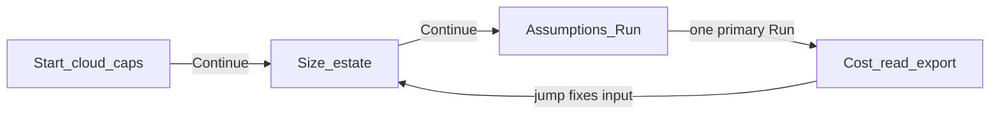

# Estimator UI flow (SSOT)

North star: PANW SE / cloud owner gets a credible monthly customer-infra **$** in under two minutes without learning the UI. Cost is the payoff; Inputs is the path; Advanced stays advanced.

## Target flow

## Happy path (minimal presses)

1. **Inputs · Start** — pick Azure · audit-only (or provider + caps).
2. **Continue** → Size (tweak only if needed) → **Continue** → Assumptions & run.
3. Press **Run estimate** once → land on **Cost output** with monthly $ + drivers.
4. Optional: flip meters, Projections, Compare, Export.

## When to press what

| Control | When |
| --- | --- |
| `journey-step-continue` | Start and Size only — advance wizard |
| `journey-step-back` | Go to previous Inputs step |
| `run-estimate` | Compute (or **Retry estimate** when `error`); success switches to Cost |
| `auto-run-toggle` | Beside Run — refresh on edit without leaving Inputs |
| `auto-update-status-chip` | On Cost — toggles auto-run **in place** (does not navigate) |
| `journey-tab-cost` | Peek at Cost without running; empty → Go to Inputs |
| `journey-tab-inputs` | Return to enter / size |
| Driver **Jump to …** | Switch to the right Inputs step and focus the field |
| Advanced (assumptions / offline / freeze / calibration) | Power tools — not on the happy path |

## Primary CTA rule

- **One primary CTA per screen**: Continue (steps 1–2) or Run estimate (step 3).
- Mode tabs = navigation, not “do work.”
- Never two adjacent buttons that both claim to show cost.

## Removed / not used

- `view-cost-output` — removed (use Cost tab or successful Run).
- Separate `retry-estimate` button — merged into `run-estimate` label.
- `empty-run-estimate` — removed; Cost empty uses **Go to Inputs** only.
